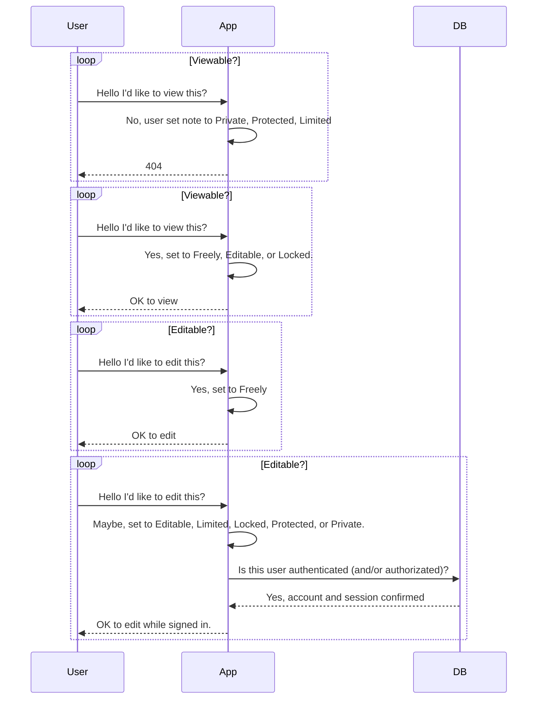
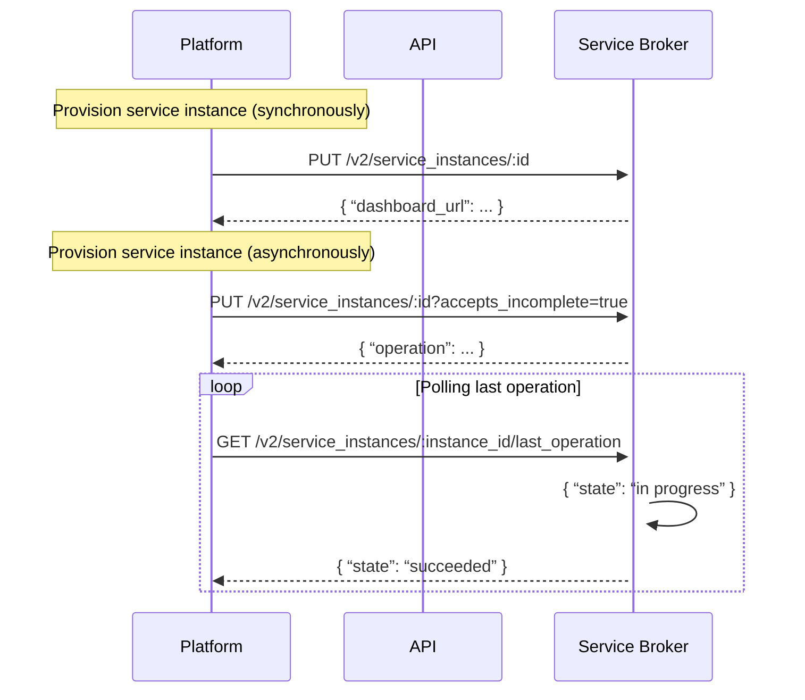
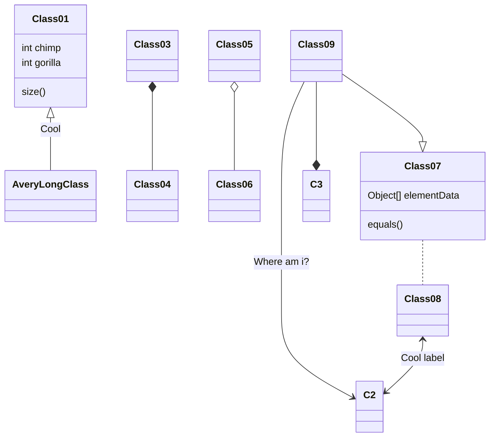

# [WIP] Codimd Security Controls for operating on Cloud.gov

:::spoiler What is here?
Demo example of documenting security controls for (any) app running on Cloud.gov. The YAML below responds to [Cloud.gov's Customer Responsibility Matrix (CRM)](https://cloud.gov/docs/compliance/customer-separation/)
:::

[Not exactly the full list of cloud.gov controls that need to be implementated](https://codimd.app.cloud.gov/8pflBnmNT-OgiY0nSy_yyw)

```yaml
cloudgov-crm:
    SC-8:
        name: "cloud.gov requires that customer applications use HTTPS. HSTS is enabled by default. Customers are responsible for enabling stricter HSTS settings if they need to. Customers are responsible for selecting a name resolution service that fulfills this requirement and for obtaining certificates for custom domains."
        response: |
        	"Codimd inherits the TLS protection from the cloud.gov proxy server's implementation of Lets Encrypt and its monthly renewal through the ACME automated renewal implementation. The app is also configured to use a TLS connection to broker communications from the app to the postgresql database whose certificate is automatically renewed at each deployment."
        implementation_status: complete
        ref:
            - SC-20
    SC-28:
        name: "cloud.gov EBS volumes, RDS, and S3 buckets are encrypted at rest. Customers are responsible for further encrypting any sensitive information in their customer applications, and for auditing the permissions their users have for managing their applications."
        response: |
		"The app is also configured to use a TLS connection to broker communications from the app to the postgresql database whose certificate is automatically renewed at each deployment. The s3 connection to upload images is also using a TLS interconnection with the brokered s3 bucket. All data is stored in postgres or s3, no storage and information is stored on disk, so EBS is not a factor for this system."
        implementation_status: complete
        ref:
            - 'SC-28 (1)'
    AC-2 (3):
        name: "If customers use customer enterprise single-sign-on identity systems, customers are responsible for configuring, monitoring, and managing their authentication systems. This includes Monitoring (and handling or restricting) inactive accounts, inactive authentication sessions, shared/group access, and invalid login attempts. Implementing multi-factor authentication (MFA) for all accounts. Handling identity verification, management, and authorization. Managing authenticators. Conforming to FICAM-issued profiles, if applicable."
        response: |
        	"Codimd leverages Github Oauth to the 18f github organization which is controlled and managed by the TTS Tech Portfolio. The secrets are closely controlled and monitored for disclosure in application updates and the files where those secrets are provided during the cloud.gov deployment are confirmed to be included in the .gitignore file to avoid committing them to our version control system. The application requires authorization confirmation that the user able to edit content by default is a member of the 18f organization and all edits/changes to content is attributable to that user. By default all notes are status `Editable` which requires user authentication. For external user engagements these permissions can be changed to not require auth^2; but users not authenticating to the application cannot delete history. If any any content is altered while the note is in a `freely` editable state for broader collaboration, all changes can be audited and/or reverted to their original state"
        implementation_status: complete
        ref:
            - 'AC-2 (5)'
            - 'AC-2 (9)'
            - 'AC-2 (10)'
            - AC-7
            - 'IA-2 (1)'
            - 'IA-2 (2)'
            - IA-4
            - 'IA-4 (4)'
            - IA-5
            - 'IA-5 (1)'
            - 'IA-5 (2)'
            - 'IA-5 (3)'
            - 'IA-5 (4)'
            - 'IA-5 (6)'
            - 'IA-8 (4)'
    RA-5:
        name: "Customers are responsible for scanning for vulnerabilities in their applications."
        response: |
        	"Both Dependabot and LGTM services from Github will be enabled to ensure vulnerable packages are promptly updated and tested for nodejs dependencies."
        implementation_status: complete
    AC-2:
        name: "Customers are responsible for managing the External roles listed in Table 9-1 User Roles and Privileges (including Application System Owner, Org Manager, Org Auditor, Space Manager, Space Developer, and Space Auditor), which are the roles available for customer Orgs, Spaces, and Applications. Customer responsibility includes assigning personnel to those roles (using the principle of least privilege), removing them from roles, and identifying non-organizational users with access."
        response: |
        	"This application is not intended to be more than an intermediate for information retention and never the single source of truth. It is only for collaboration, where the content is developed and then posted to official records systems. Members are allowed to create new notes and invite anyone (by default apart of the 18f org), or alter the permissions to invite external contributors for the extent of their external engagement. Users are the only owners for the notes they create, and cannot alter or deleted other user's notes by default or unless that other user actively grants them said authorization over those notes. As such users are responsible for managing the integrity and confidentiality of their notes, understanding this is a Low/Low/Low system. Furthermore the application is intended to be semi-ephemeral, in that there is no commitment or expectation for this system to manage information retention. This application is only a means to facilitate real-time editing of content, which should be externally saved and retained in an already approved system such as github or google drive without expectations of retention immediately after its use."
        implementation_status: complete
        ref:
            - 'AC-2 (7)'
            - AC-5
            - AC-6
            - IA-8
    SC-4:
        name: "Customers are responsible for managing access to their customer application data."
        response: |
        	"the application is intended to be semi-ephemeral, in that there is no commitment or expectation for this system to manage information retention. This application is only a means to facilitate real-time editing of content, which should be externally saved and retained in an already approved system such as github or google drive without expectations of retention immediately after its use."
        implementation_status: complete
    IR-9:
        name: "Customers are responsible for identifying and handling information spills related to their applications, including identifying the specific information involved, alerting appropriate personnel, implementing procedures, and training personnel. Customers may request assistance from cloud.gov for handling information spills."
        response: |
        	"Notes created have a very unique URL/URI that is actively denied from search bots (via robots.txt) from search provider indexing. Furthermore if there is information that is CUI/Classifed/PII related that is shared the administrator will be notified in the standard TTS IR response and the note will be removed from the database within standard acceptance timelines. Note owner's are responsible for following GSA and TTS IR response plans and procedures."
        implementation_status: partial
        ref:
            - IR-9
            - 'IR-9 (1)'
            - 'IR-9 (2)'
            - 'IR-9 (3)'
            - 'IR-9 (4)'
    CM-7 (5):
        name: "Customers are responsible for identifying and authorizing the software programs within their application spaces."
        implementation_status: complete
        response: |
        	"TTS monitors and manages the application, due to its simplicity of consisting of only one frontend component (nodejs application) and one backend component (postgresql) maintenance of the software dependencies updating and patching easy to manage via automated patching from dependabot and LGTM. Secret disclosure are tightly controlled and audited via the .cfignore and .gitignore files in place. Note owner's are responsible for following GSA and TTS IR response plans and procedures."
    SI-12:
        name: "Customers are responsible for fulfilling information handling and storage requirements in their applications in accordance with applicable federal laws, Executive Orders, directives, policies, regulations, standards, and operational requirements."
        response: "confirmed"
        implementation_status: complete
    IA-5 (7):
        name: "Customers are responsible for ensuring that unencrypted static authenticators are not embedded in applications or access scripts or stored on function keys."
        response: "confirmed"
        implementation_status: complete
    CM-7 (2):
        name: "Customers are responsible for ensuring that their applications comply with the cloud.gov Rules of Behavior (Use your account responsibly on https://cloud.gov/docs/getting-started/accounts/) and all applicable federal and agency laws and policies."
        response: "confirmed"
        implementation_status: complete
    AU-2:
        name: "Customers are responsible for ensuring that their application's activities are monitored and captured within audit logs, and for reviewing and analyzing their application logs. They may use cloud.gov's built-in logging features to help them fulfill this requirement."
        response: "confirmed"
        implementation_status: complete
        ref:
            - AU-6
            - 'AU-6 (3)'
            - 'AU-7 (1)'
    PS-6:
        name: "Customer agencies and cloud.gov have a shared responsibility to create, review, and approve inter-agency agreements (IAAs) that allow customer agencies to access and use cloud.gov."
        response: "confirmed"
        implementation_status: complete
```
## Dataflow Diagrams


### Permissions:
It is possible to change the access permission to a note through the little button on the top right of the view.
There are six possible options:

|                              |Owner read/write|Signed-in read|Signed-in write|Guest read|Guest write|
|:-----------------------------|:--------------:|:------------:|:-------------:|:--------:|:---------:|
|<span class="text-nowrap"><i class="fa fa-leaf fa-fw"></i> **Freely**</span>               |✔|✔|✔|✔|✔|
|<span class="text-nowrap"><i class="fa fa-pencil fa-fw"></i> **Editable**</span>           |✔|✔|✔|✔|✖|
|<span class="text-nowrap"><i class="fa fa-id-card fa-fw"></i> **Limited**</span>           |✔|✔|✔|✖|✖|
|<span class="text-nowrap"><i class="fa fa-lock fa-fw"></i> **Locked**</span>               |✔|✔|✖|✔|✖|
|<span class="text-nowrap"><i class="fa fa-umbrella fa-fw"></i> **Protected**</span>        |✔|✔|✖|✖|✖|
|<span class="text-nowrap"><i class="fa fa-hand-stop-o fa-fw"></i> **Private**</span>       |✔|✖|✖|✖|✖|


**Only the owner of the note can change the note's permissions.**




### Web App Minimal Controls


---
### EXTRA/IGNORE

#### DB Provisioning



#### Data Classes (fictional)



